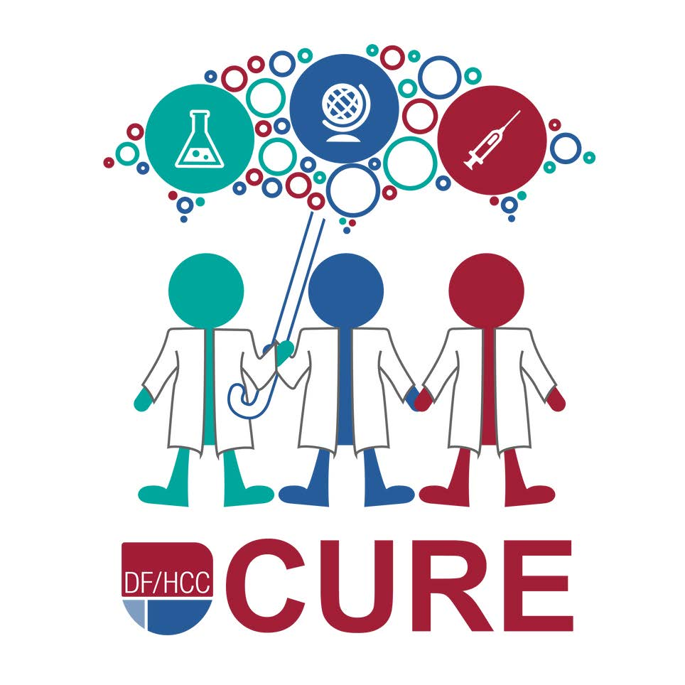

{width=200px}
{width=200px}
{width=200px}

The Bioconductor project has partial support from the Chan Zuckerberg Initiative
in a Diversity and Inclusiveness special program.

A brief summary of the project [is available](https://chanzuckerberg.com/eoss/proposals/bioconductor-sustaining-a-worldwide-community-of-genome-data-scientists/).  A main objective of
the project is the production of open-source teaching materials that can
be used for the engagement of high-school and undergraduate students
from underrepresented communities
in cancer data science.

This site has been created to help encourage scientists at Channing Division of Network Medicine
and Harvard TH Chan School of Public Health to consider participating in the Dana Farber/Harvard Cancer
[YES for CURE](https://www.dfhcc.harvard.edu/research/cancer-disparities/students/yes-for-cure/)
mentoring program.  This program falls under the DFCI Initiative to Eliminate Cancer Disparities
founded in 2001.

Mentoring activities will be linked to the establishment of content and 
open, accessible teaching methods for introducing cancer
data science early in students' educational experience.  Participating
in mentorship will have multiple follow-on effects:

- help grow the workforce
- help pursue goals of equity and inclusiveness
- bring fresh eyes and intuitions to your research efforts
- explore potentials for growing this initiative beyond cancer data science

To apply for consideration of a mentoring project, complete [this form](https://www.surveymonkey.com/r/dfhccmentor2022).
Applications should be submitted by the end of February; contact stvjc at channing dot harvard dot edu if
more time is needed.

More details are provided in links below that point to PDF documents on mentoring
recruitment and training processes of YES for CURE.  If you have questions
please contact stvjc at channing dot harvard dot edu or file an [issue](https://github.com/vjcitn/CUREMentoring/issues).

---

DF/HCC STUDENT TRAINING PROGRAMS: MISSION

DF/HCC provides high school and college students from underrepresented and 
disadvantaged backgrounds comprehensive hands-on mentored research experiences 
and guidance in academic and professional development.

Our mission is to:

- PROVIDE **ACCESS** TO MASSACHUSETTS YOUTH
- **BUILD THE PIPELINE** OF TALENTED AND DIVERSE STEM RESEARCHERS
- ACHIEVE **MEASURABLE IMPACT** FOR YOUNG STEM PROFESSIONALS
- CREATE AND FACILITATE **OPPORTUNITIES IN MENTORSHIP** FOR GRADUATE STUDENTS, POST DOCTORAL FELLOWS, AND FACULTY

---

Background on mentoring for YES for CURE

[Recruitment flyer](https://github.com/vjcitn/CUREMentoring/blob/main/Mentor%20Recruitment%202022.pdf)

[Training for mentors flyer](https://github.com/vjcitn/CUREMentoring/blob/main/Mentor%20Recruitment%202022.pdf)
