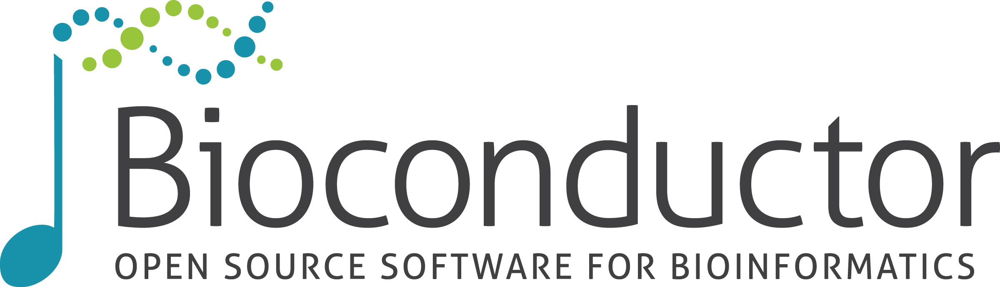

# Mentoring opportunity: Cancer data science for undergraduate and high school students

{width=200px}
{width=200px}
{width=200px}

**Program Description:**

The Continuing Umbrella of Research Experiences (CURE) [program](https://chanzuckerberg.com/eoss/proposals/bioconductor-sustaining-a-worldwide-community-of-genome-data-scientists/) introduces Massachusetts high school and college students from underrepresented populations to the world of cancer research by placing them in real research settings at local cancer research institutions. Our goal is to encourage students to pursue future careers in the biosciences—particularly cancer research—giving practical meaning to academic course work and to expand and extend their interest in basic, clinical and/or population science research.  This program falls under the DFCI Initiative to Eliminate Cancer Disparities
founded in 2001.

The Chan Zuckerberg Initiative Essential Open Source Software (EOSS) program has [funded the
Bioconductor project](https://chanzuckerberg.com/eoss/proposals/bioconductor-sustaining-a-worldwide-community-of-genome-data-scientists/) to engage with CURE to support outreach in cancer data science.

**Why you should volunteer:**

- Help grow the cancer data science workforce
- Help pursue goals of equity and inclusiveness
- Bring fresh eyes and intuitions to your research efforts
- Explore potentials for growing this initiative beyond cancer data science

**Mentoring Opportunity:**

- Learn about the [2022 summer program](https://www.dfhcc.harvard.edu/research/cancer-disparities/students/cure-overview/)
- Commit to mentoring a student in Summer 2022
    - Students commit to 8-12 weeks of full-time work
    - May 31 - August 19 2022
- Provide an appropriate research project,space, resources, and mentorship
- Oversee student creation of a learning plan, abstract, and scientific presentation of their projects
- Receive training on mentoring processes, attend mandatory mentor orientation

If interested in joining the CURE mentor communites' commitment to building a diverse research workforce and our collective effort to support the communities in which we work please fill out [this form](https://www.surveymonkey.com/r/dfhccmentor2022).  If you have questions, email stvjc at channing dot harvard dot edu.

<!--
The Bioconductor project has partial support from the Chan Zuckerberg Initiative
in a Diversity and Inclusiveness special program.

This site has been created to help encourage scientists at Channing Division of Network Medicine
and Harvard TH Chan School of Public Health to consider participating in the Dana Farber/Harvard Cancer
[YES for CURE](https://www.dfhcc.harvard.edu/research/cancer-disparities/students/yes-for-cure/)
mentoring program.  This program falls under the DFCI Initiative to Eliminate Cancer Disparities
founded in 2001.

Mentoring activities will be linked to the establishment of content and 
open, accessible teaching methods for introducing cancer
data science early in students' educational experience.  Participating
in mentorship will have multiple follow-on effects:

To apply for consideration of a mentoring project, complete [this form](https://www.surveymonkey.com/r/dfhccmentor2022).
Applications should be submitted by the end of February; contact stvjc at channing dot harvard dot edu if
more time is needed.

More details are provided in links below that point to PDF documents on mentoring
recruitment and training processes of YES for CURE.  If you have questions
please contact stvjc at channing dot harvard dot edu or file an [issue](https://github.com/vjcitn/CUREMentoring/issues).

---

DF/HCC STUDENT TRAINING PROGRAMS: MISSION

DF/HCC provides high school and college students from underrepresented and 
disadvantaged backgrounds comprehensive hands-on mentored research experiences 
and guidance in academic and professional development.

Our mission is to:

- PROVIDE **ACCESS** TO MASSACHUSETTS YOUTH
- **BUILD THE PIPELINE** OF TALENTED AND DIVERSE STEM RESEARCHERS
- ACHIEVE **MEASURABLE IMPACT** FOR YOUNG STEM PROFESSIONALS
- CREATE AND FACILITATE **OPPORTUNITIES IN MENTORSHIP** FOR GRADUATE STUDENTS, POST DOCTORAL FELLOWS, AND FACULTY

---

Background on mentoring for YES for CURE

[Recruitment flyer](https://github.com/vjcitn/CUREMentoring/blob/main/Mentor%20Recruitment%202022.pdf)

[Training for mentors flyer](https://github.com/vjcitn/CUREMentoring/blob/main/Mentor%20Recruitment%202022.pdf)
-->
